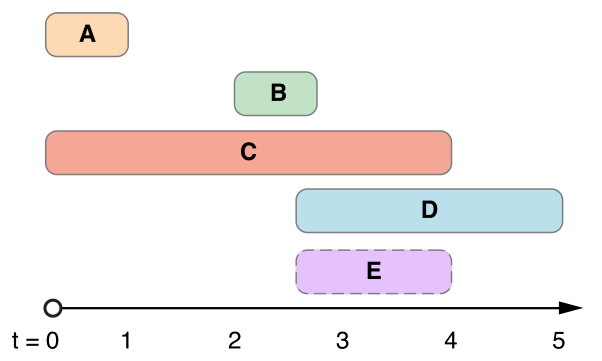

## `genericFilter`

The `genericFilter` function is designed to filter an array of objects based on various filter criteria provided in an array. It supports filtering based on number ranges, single select, multi-select, and date ranges.

### Purpose

The purpose of `genericFilter` is to provide a flexible and reusable utility for filtering arrays of objects based on dynamic criteria. It accepts an array of objects and an array of filter objects, each specifying a filter criterion. The function then applies these filters sequentially to the input array and returns the filtered array.

### Function Signature

````typescript
/**
 * Filters an array of objects based on an array of filters.
 * 
 * @param {T[]} arr - The array to be filtered.
 * @param {Filter[]} filters - An array of filter objects.
 * @returns {T[]} - The filtered array.
 */
export const genericFilter = <T>(arr: T[], filters: Filter[]): T[] => { ... };

````

### Examples

> Ensure that the objects in the array (`arr`) have properties matching the filter paths provided.

#### Filtering by Number Range

````typescript
const data = [
    { id: 1, age: 25 },
    { id: 2, age: 30 },
    { id: 3, age: 35 }
];

const filters = [
    { type: "numberRange", path: ["age"], value: [25, 30] }
];

const filteredData = genericFilter(data, filters);
// filteredData: [{ id: 1, age: 25 }, { id: 2, age: 30 }]
````

##### Using operations

Operations allow you to sum, subtract, divide, or multiply values in an array before applying the filtering process. This means the filter operates on the result of the operation rather than on individual values.

In the example below, we use the addition (`+`) operation to sum up the total grades for each user and then filter the results to include only those with total grades between 30 and 60.

````typescript
const data = [
    {
        age: 50,
        grades: [
            { grade: 10 },
            { grade: 20 },
            { grade: 30 }
        ]
    },
    {
        age: 30,
        grades: [
            { grade: 10 },
            { grade: 50 },
            { grade: 30 }
        ]
    },
    {
        age: 45,
        grades: [
            { grade: 10 },
            { grade: 20 },
            { grade: 100 }
        ]
    }
];

const filters = [
    {
        path: ["grades.grade"],
        operation: "+",
        type: "numberRange",
        value: [30, 60]
    }
];

const filteredData = genericFilter(data, filters);


// filteredData: [
// {
//     age: 50,
//         grades: [
//             { grade: 10 },
//             { grade: 20 },
//             { grade: 30 }
//         ]
// }
// ]
````

#### Filtering by Single Select

````typescript
const data = [
    { id: 1, status: "active" },
    { id: 2, status: "inactive" },
    { id: 3, status: "active" }
];

const filters = [
    { type: "singleSelect", path: ["status"], value: "active" }
];

const filteredData = genericFilter(data, filters);
// filteredData: [{ id: 1, status: "active" }, { id: 3, status: "active" }]
````

#### Filtering by Multi-Select

````typescript
const data = [
    { id: 1, category: "A" },
    { id: 2, category: "B" },
    { id: 3, category: "C" }
];

const filters = [
    { type: "multiSelect", path: ["category"], value: ["A", "B"] }
];

const filteredData = genericFilter(data, filters);
// filteredData: [{ id: 1, category: "A" }, { id: 2, category: "B" }]
````

#### Filtering by Date Range in a Date Range



[The image is from (developer.apple.com](https://developer.apple.com/documentation/foundation/nsdateinterval/1641645-intersectionwithdateinterval)

````typescript
const data = [
    { id: 1, startDate: "2022-01-01", endDate: "2022-02-01" },
    { id: 2, startDate: "2022-03-01", endDate: "2022-04-01" },
    { id: 3, startDate: "2022-05-01", endDate: "2022-06-01" }
];

const filters = [
    { type: "dateRangeInRange", path: ["startDate", "endDate"], value: ["2022-02-01", "2022-05-01"] }
];

const filteredData = genericFilter(data, filters);
// filteredData: [{ id: 2, startDate: "2022-03-01", endDate: "2022-04-01" }]
````

By default, `dateRangeInRange` operates in `strict` mode, requiring the date range to be strictly within the specified range. To disable strict mode, set the `strict` attribute to false in the filter object.

````typescript
const filters = [
    { type: "dateRangeInRange", path: ["startDate", "endDate"], value: ["2022-02-01", "2022-05-01"], strict: false }
];
````


By default, `dateRangeInRange` checks if the provided value date range fits within the data's date ranges. If you want to check if the data's date ranges fit within the provided value date range, you can set the `dataRangePrimary` attribute to true.

```typescript
const filters = [
    { type: "dateRangeInRange", path: ["startDate", "endDate"], value: ["2022-02-01", "2022-05-01"], strict: false, dataPrimary: true }
];
```


#### Filtering By Single Date In a Daterange

`````typescript
const data = [
    { id: 1, startDate: "2022-01-01", endDate: "2022-02-01" },
    { id: 2, startDate: "2023-03-01", endDate: "2023-04-01" },
    { id: 3, startDate: "2024-05-01", endDate: "2024-06-01" }
];

const filters = [
    { type: "dateRangeInRange", path: ["startDate"], value: ["2022-01-01", "2022-05-01"] }
];

const filteredData = genericFilter(data, filters);
// filteredData: [{ id: 1, startDate: "2022-01-01", endDate: "2022-02-01" }]
`````

## `chunkArray`

The `chunkArray` function splits an array into smaller arrays (chunks) of a specified size. This can be useful for processing large arrays in smaller, manageable pieces.

### Purpose

The purpose of `chunkArray` is to divide an array into smaller sub-arrays (chunks) of a specified size, making it easier to handle large datasets or perform operations on smaller groups of elements.

large datasets or perform operations on smaller groups of elements.

### Function Signature

````typescript
/**
 * Splits an array into chunks of a specified size.
 * 
 * @param {T[]} array - The array to chunk.
 * @param {number} size - The size of each chunk.
 * @returns {T[][]} - The array split into chunks.
 * @throws {Error} - Throws an error if the size is not a positive number.
 */
export const chunkArray = <T>(array: T[], size: number): T[][] => {...};
````

### Example

#### Chunking an Array

````typescript
const data = [1, 2, 3, 4, 5, 6, 7, 8, 9];

const chunkSize = 3;

const chunks = chunkArray(data, chunkSize);
// chunks: [[1, 2, 3], [4, 5, 6], [7, 8, 9]]
````

In this example, the input array `[1, 2, 3, 4, 5, 6, 7, 8, 9]` is split into chunks of size `3`, resulting in an array of arrays: `[[1, 2, 3], [4, 5, 6], [7, 8, 9]]`.

### Notes

* If the size of the array is not perfectly divisible by the chunk size, the last chunk will contain the remaining elements.
* An error will be thrown if the specified size is not a positive number.

## sortDataset

The `sortDataset` function sorts an array of objects based on the type of the attribute specified (`sortBy`). It automatically detects whether the data is a number, string, or date, and sorts accordingly in ascending or descending order (`asc` or `desc`).

### Purpose

The purpose of `sortDataset` is to provide a flexible sorting mechanism for arrays of objects, accommodating different data types without requiring explicit type checking.

### Function Signature

````typescript
/**
 * Sorts an array of objects based on a specified attribute and order.
 * Automatically detects if the attribute values are numbers, strings, or dates.
 * 
 * @param {T[]} dataset - The array of objects to be sorted.
 * @param {SortBy} sortBy - An object specifying the attribute and order of sorting.
 * @returns {T[]} - The sorted array of objects.
 */
export const sortDataset = <T>(dataset: T[], sortBy: SortBy): T[] => {...};

````

### Example

```typescript
import { sortDataset } from './utils';

// Sample dataset of objects
const dataset = [
    { id: 1, name: 'John', age: 30 },
    { id: 2, name: 'Jane', age: 25 },
    { id: 3, name: 'Doe', age: 35 }
];

// Sort dataset by 'age' in ascending order
const sortedDataset = sortDataset(dataset, { attribute: 'age', order: 'asc' });
console.log(sortedDataset);
// [{ id: 2, name: 'Jane', age: 25 }, { id: 1, name: 'John', age: 30 }, { id: 3, name: 'Doe', age: 35 }]
```
